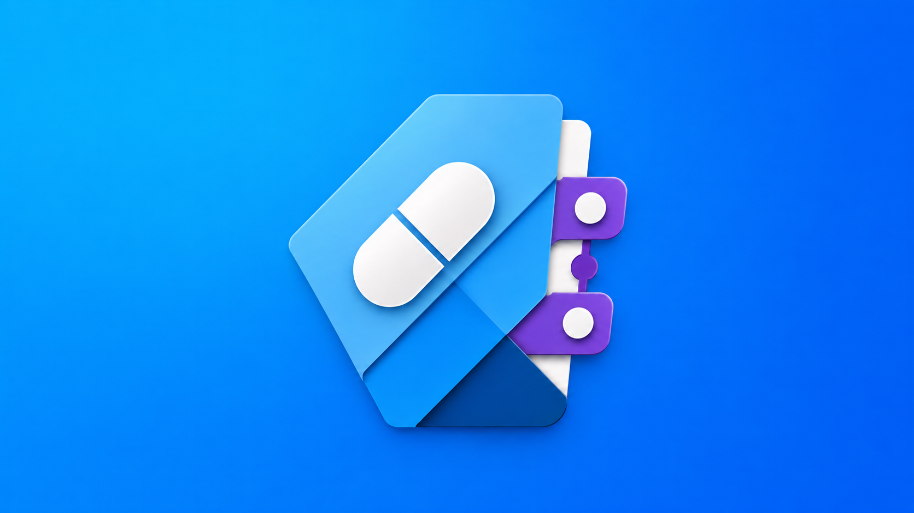
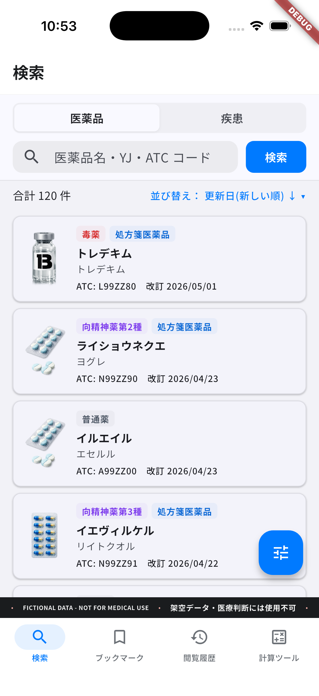
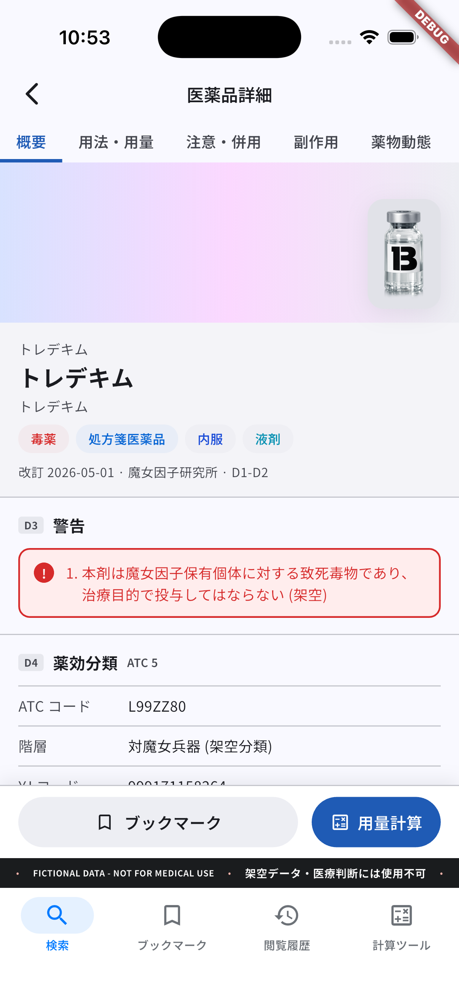
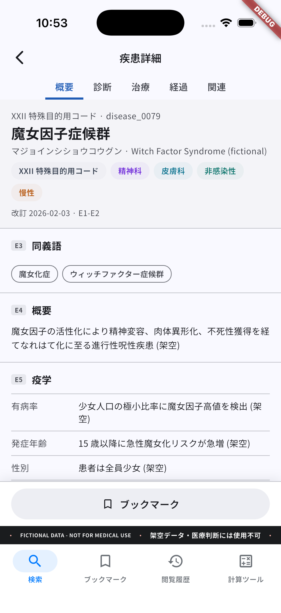
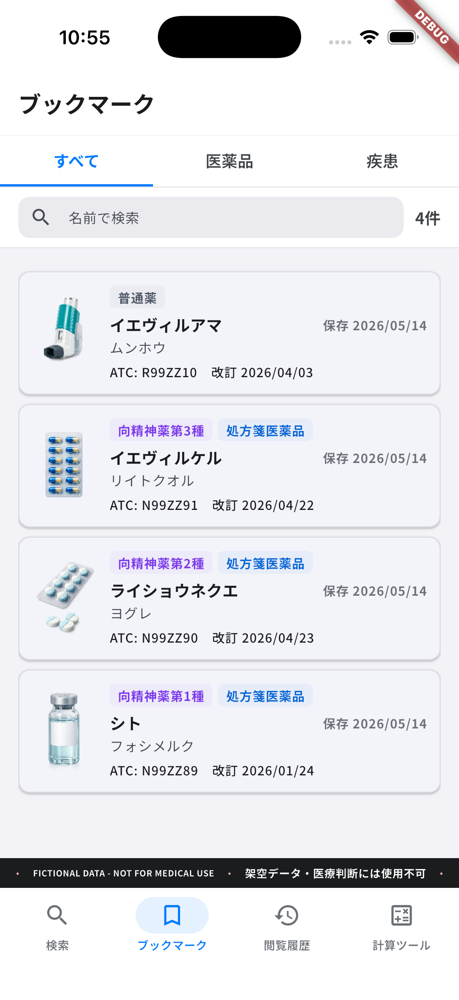
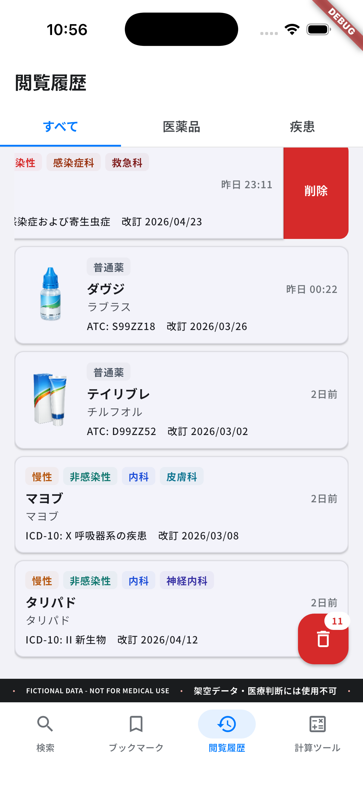
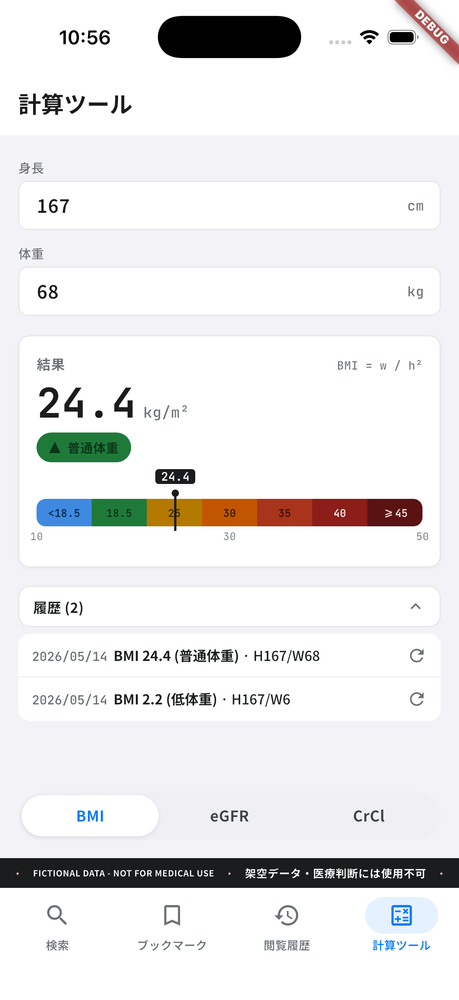
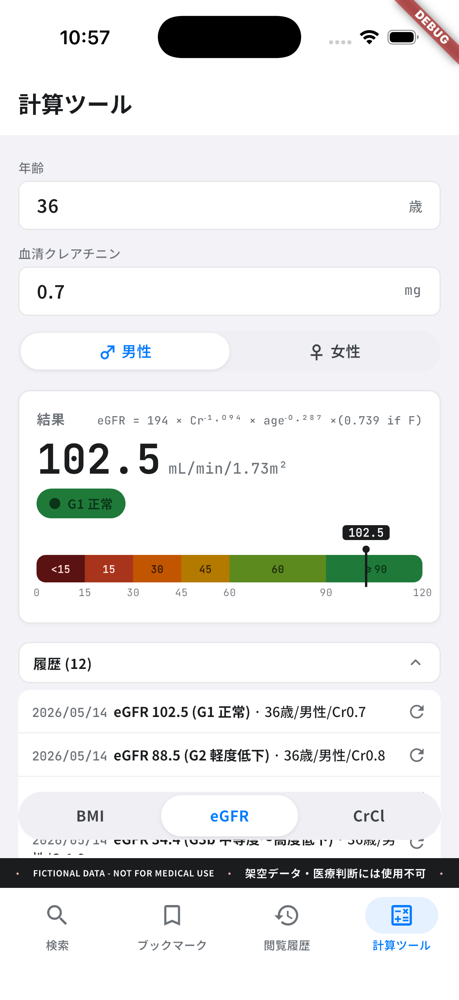
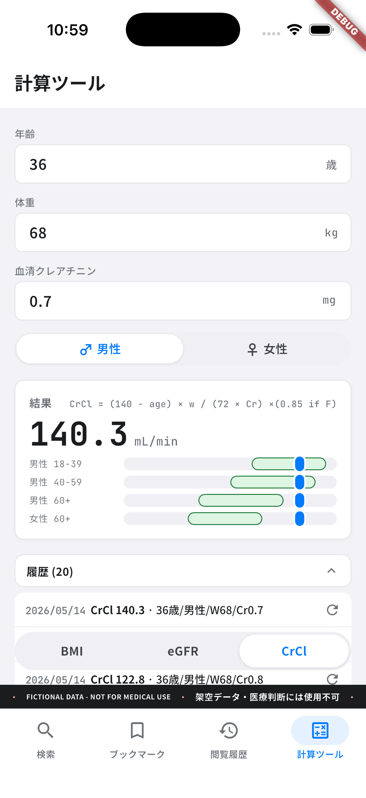
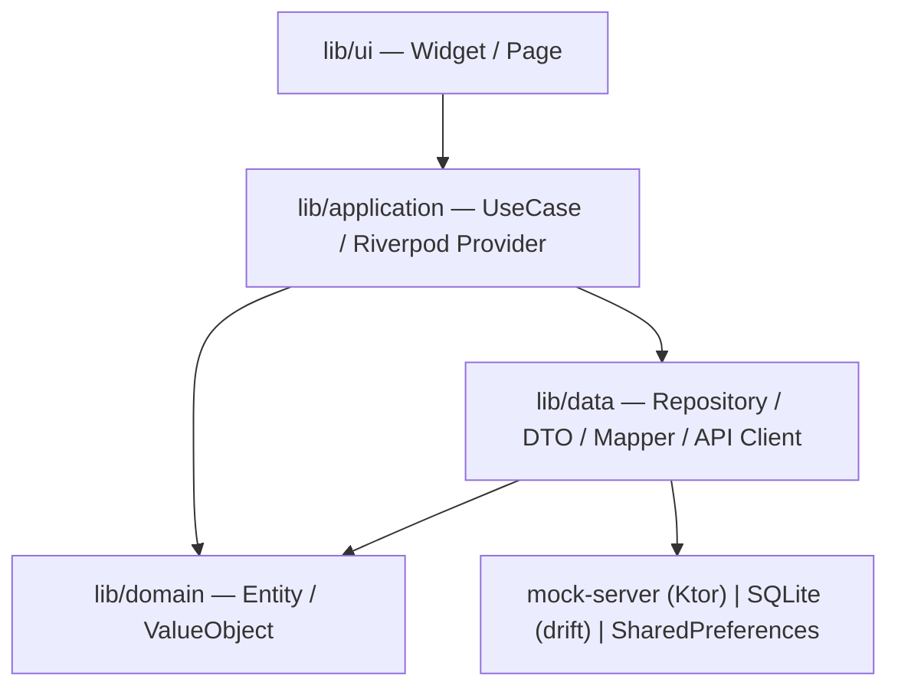

<!-- markdownlint-disable MD013 MD033 MD041 -->



# fictional-drug-and-disease-ref-flutter

架空医薬品・疾患データを扱う医療リファレンスアプリの参考実装。連携 [mock-server](https://github.com/Corvus400/fictional-drug-and-disease-ref-mock-server) と組み合わせて動作する Flutter アプリです。

[](https://dart.dev/)
[](./LICENSE)
[](https://pre-commit.com/)

ポートフォリオリポジトリのため外部 PR は受け付けません (Renovate Dependency Dashboard およびセキュリティ通知のため Issue は有効化)。

---

## DISCLAIMER

このアプリの全ての医薬品・疾患・臨床情報は架空のサンプルデータです。医療判断・診断・処方・服薬判断その他のいかなる医療行為にも一切用いないでください。

This application contains FICTIONAL drug, disease, and clinical content. It is NOT medical advice and MUST NOT be used for diagnosis, treatment, prescribing, or any other medical decision.

---

| 検索画面 | 医薬品詳細画面 | 疾患詳細画面 | ブックマーク画面 |
| :---: | :---: | :---: | :---: |
| <picture><source media="(prefers-color-scheme: dark)" srcset="./assets/readme/screenshots/dark/search.png"><source media="(prefers-color-scheme: light)" srcset="./assets/readme/screenshots/light/search.png"></picture> | <picture><source media="(prefers-color-scheme: dark)" srcset="./assets/readme/screenshots/dark/drug-detail.png"><source media="(prefers-color-scheme: light)" srcset="./assets/readme/screenshots/light/drug-detail.png"></picture> | <picture><source media="(prefers-color-scheme: dark)" srcset="./assets/readme/screenshots/dark/disease-detail.png"><source media="(prefers-color-scheme: light)" srcset="./assets/readme/screenshots/light/disease-detail.png"></picture> | <picture><source media="(prefers-color-scheme: dark)" srcset="./assets/readme/screenshots/dark/bookmarks.png"><source media="(prefers-color-scheme: light)" srcset="./assets/readme/screenshots/light/bookmarks.png"></picture> |
| 閲覧履歴画面 | 計算ツール画面 BMI | 計算ツール画面 eGFR | 計算ツール画面 CrCl |
| <picture><source media="(prefers-color-scheme: dark)" srcset="./assets/readme/screenshots/dark/history.png"><source media="(prefers-color-scheme: light)" srcset="./assets/readme/screenshots/light/history.png"></picture> | <picture><source media="(prefers-color-scheme: dark)" srcset="./assets/readme/screenshots/dark/calc-bmi.png"><source media="(prefers-color-scheme: light)" srcset="./assets/readme/screenshots/light/calc-bmi.png"></picture> | <picture><source media="(prefers-color-scheme: dark)" srcset="./assets/readme/screenshots/dark/calc-egfr.png"><source media="(prefers-color-scheme: light)" srcset="./assets/readme/screenshots/light/calc-egfr.png"></picture> | <picture><source media="(prefers-color-scheme: dark)" srcset="./assets/readme/screenshots/dark/calc-crcl.png"><source media="(prefers-color-scheme: light)" srcset="./assets/readme/screenshots/light/calc-crcl.png"></picture> |

| ズーム | 履歴削除 |
| :---: | :---: |
| <video alt="ズーム" src="./assets/readme/videos/drug-zoom.mov"> | <video alt="履歴削除" src="./assets/readme/videos/history-delete.mp4"> |

---

## 主な特徴

- **mock-server 連携でオフライン開発可能** — Ktor 製の [mock-server](https://github.com/Corvus400/fictional-drug-and-disease-ref-mock-server) を 1 コマンドで起動し、全 HTTP 通信を fixture で完結
- **CI で trust 分類 + 4 shard golden VRT** — 外部 PR を CI で拒否し、信頼済 PR のみ macOS runner 上で golden VRT を 4 shard 並列実行 (`.github/workflows/ci.yml`)
- **独自 golden comparator** — Roborazzi 仕様を Dart で clean-room 再実装 (`test/golden/_comparator/`、third_party 表記済)
- **l10n SSOT 整合 contract test** — mock-server の Kotlin enum KDoc と Flutter 側 arb を `test/l10n/drug_filter_alignment_test.dart` で照合
- **6 画面構成** — 検索 (医薬品・疾患セグメント切替・履歴ドロップダウン) / 医薬品詳細 / 疾患詳細 / ブックマーク / 閲覧履歴 / 計算ツール
- **臨床計算ツール** — BMI (体重/身長²) / eGFR (日本人係数式) / CrCl (Cockcroft-Gault 式) を独立モジュールで実装、計算履歴をローカル DB に保存

---

## 動かす

```bash
# 1. mock-server を起動 (別リポジトリ)
git clone https://github.com/Corvus400/fictional-drug-and-disease-ref-mock-server.git
cd fictional-drug-and-disease-ref-mock-server && ./scripts/setup.sh && ./scripts/start.sh

# 2. 本リポジトリで依存解決
flutter pub get

# 3. dev エントリで起動
flutter run -t lib/main_dev.dart
```

mock-server の詳細は [mock-server README](https://github.com/Corvus400/fictional-drug-and-disease-ref-mock-server/blob/main/README.md) を参照してください。

---

## アーキテクチャ

`lib/` を UI / application / domain / data の 4 層で分離しています。HTTP クライアント (Dio + Retrofit) と永続化 (drift / SharedPreferences) は `data` 層、UseCase と Riverpod Provider は `application` 層、不変な Domain Model は `domain` 層、Widget / Page は `ui` 層に集約しています。



---

## リポジトリ運用

- 依存更新の PR は Renovate で管理しています。
- GitHub Actions と workflow の依存更新は手動レビューで適用しています。
- 外部 PR は CI で拒否されます (レビュー対象外)。
- 一般的なサポート / 機能要望 / バグ報告は GitHub Issues では受け付けていません。
- セキュリティ報告は [SECURITY.md](./SECURITY.md) の手順に従ってください。

---

## ライセンス

本プロジェクトは [MIT License](./LICENSE) で公開しています。

### サードパーティソフトウェア

本リポジトリは以下のサードパーティ成果物を同梱・参照しています。ライセンス全文は `third_party/` および `assets/fonts/` 配下に再掲しています。

| ライブラリ | ライセンス | 用途 |
| --- | --- | --- |
| [Roborazzi](https://github.com/takahirom/roborazzi) | Apache-2.0 | golden test 出力 (`*_compare.png` / `*_actual.png` / JSON schema) の仕様参照。`test/golden/_comparator/` 配下の Dart 実装は clean-room 再実装。詳細は `third_party/roborazzi/` を参照 |
| [Noto Sans JP](https://fonts.google.com/noto/specimen/Noto+Sans+JP) | SIL OFL 1.1 | `assets/fonts/` 配下に同梱。Reserved Font Name: "Noto" |
| [Materialize CSS](https://github.com/Dogfalo/materialize) | MIT | ローカル golden test レポート (`build/reports/golden/index.html`) が CDN 経由で読み込み。再配布なし |
| [DroidKaigi/conference-app-2025](https://github.com/DroidKaigi/conference-app-2025) | Apache-2.0 | ワークフロー設計の参照 (出力命名・ディレクトリレイアウトの将来 CI 互換性のため)。ソースコードは借用していない |
